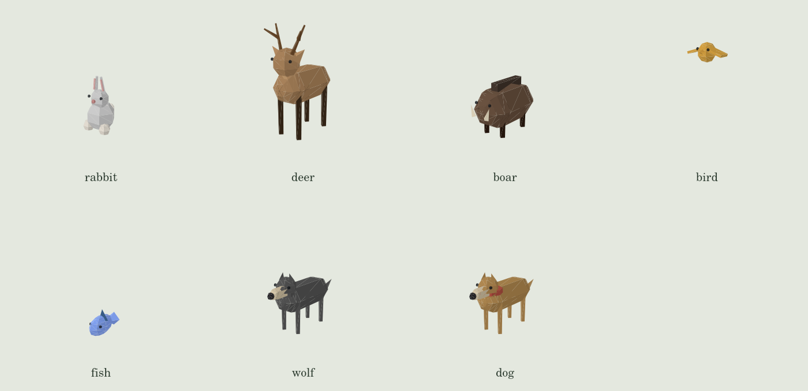

# 3D world art pass

The animal models are native Three.js geometry in `client/src/3d/world/parts/animal-model.ts`. All seven species use instanced parts, so model draw calls scale with species and detail count rather than animal population. Geometry is reused across snapshots and released when a species unmounts.

This review sheet projects the actual model triangles with a simple directional light. It verifies shape and part placement; it is not an in-game WebGL screenshot and does not verify animation, water shaders or scene lighting.

The pass also aligns the water land mask with the rotated world plane, makes the water color continuous at midnight, reuses detailed villagers in shared interiors, adds floor seams and timber framing, sharpens the compass on high-density displays and corrects compass/minimap headings.

Before merging, inspect walking and wing animation, shoreline placement, shared-room occupants and the compass in a live 3D scene. No external model download is required for dogs.
