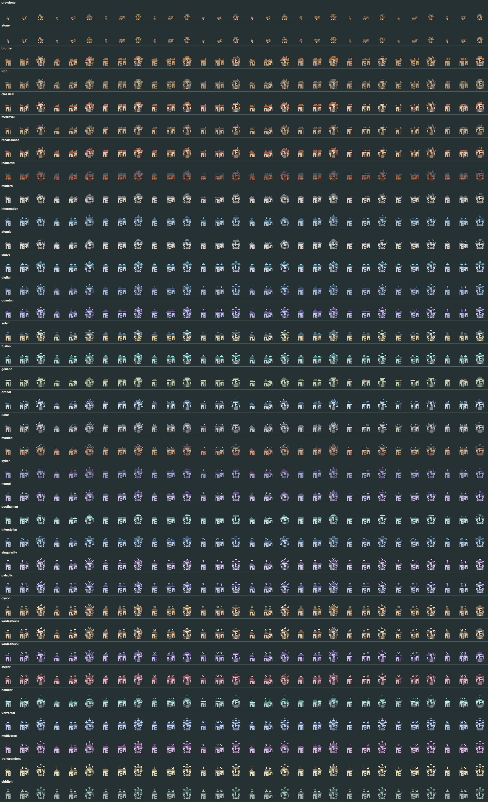

# Era home catalog

This expansion adds **30 homes to each of the simulation's 35 eras: 1,050 new `BuildingKind`s**. The original kinds remain available. Each era has ten architectural silhouettes, each composed into a single dwelling, twin dwelling and enclosed courtyard plan. Early eras use timber/weave and stone; later homes use masonry, brick, alloy panels, living roofs, pressure airlocks, collectors and luminous crowns.



Sprites use the existing Canvas pixel-art pipeline. They render at the current tile size and share the existing day/night, damage, construction, ruin and cache paths. Named homes retain their own era's architecture after their owning lineage advances; the original homes still modernize with their lineage.

## Gameplay wiring

- Each new kind has its own wire/save identity, unlock era, footprint and housing capacity. New variants are appended after all existing enum variants.
- Housing demand counts functional homes and reserved projects, excluding decorative, ruined and foreign homes. When capacity is insufficient, a deterministic lineage-specific rotation chooses among the current era's 30 types. It tries affordable earlier eras before the original housing fallback.
- Existing construction rules still reserve resources, check sites/workers, require labor and award discovery keys on completion. Completed new homes provide shelter and count toward settlement development; unfinished homes do not protect residents.
- The map resolves both PascalCase and simulation snake_case catalog names, uses authoritative footprints and shows a home icon, readable name, era and capacity in inspections.

## Review the sprites

From `client`, run `pnpm dev` and open `/home-catalog.html`. This developer-only page renders the actual world-map sprites for any era and has night/damage toggles. **Verify all sprites** renders all 1,050 homes at tile sizes 8, 12 and 16 in intact/damaged day/night states (12,600 renders), checking nonempty pixels, canvas clipping and 30 distinct images per era.

The PNG above is a contact sheet of the same sprites at tile size 12, with eras in simulation ladder order. Within each row, every consecutive trio is a single/twin/enclosed plan.

## Maintain the catalog

`assets/era-homes.json` is the shared source for Rust metadata and client metadata. After editing it, run from the repository root:

```sh
node scripts/generate-era-homes.mjs
node scripts/generate-era-homes.mjs --check
```

The generator requires installed client dependencies and `rustfmt`. It updates the marked enum/all-list blocks in `buildings.rs`, `era_homes.rs` and `era-home-catalog.ts`. Keep the order and names of published kinds stable for persisted worlds. Rust tests cover every era's housing rotation, all 1,050 save/wire records, shelter states and resource-backed construction through completion in each era. Frontend tests compare the era ladder, source manifest, sprite registry, footprints and inspection labels.
